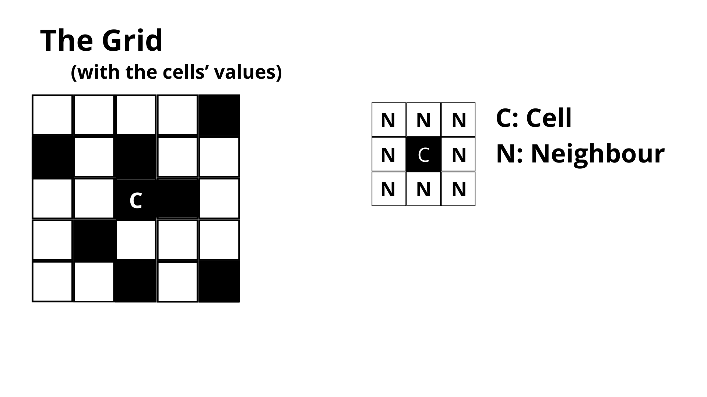
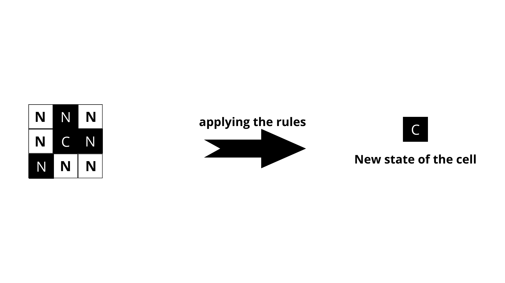

# Cellular Automaton 
## Project's Description
A computational algorithm that simulate complex systems in a lot of areas, such as physics, theoretical biology and mathematics.
## Why Python
Python is a high-level programming language and one of the fastest ever created. Its use is extended in almost every field thanks to all the libraries created and the big community that helped to buid the most used programming language in fields like ML or AI.

In this programme I will use some libraries that Python supports, such as Pygame for the graphic part.
## How the algorithm works
1. ### Base version 
    In a casual created grid (made of zeros and ones), a set of rules change the status of the cell that will be placed in another grid (now, this second grid, it's made only with a base state, for example 0).
    
    
    * #### Rules
        Analyzing one cell at the time, we look at the values of his neighbours and we follow the rules, that are:
        1. Any live cell whit fewer that two live neighbours or more than three dies, respectively by underpopulation or by overpopulation;
        2. Any dead cell with exactly three live neighbours lives, because of reproduction;
        3. All other live cells live for the next generation.
        
    * #### Algorithm example
    This is the example of the first working algorithm that I wrote. (put the example)
    * #### Final part
    This was the base of my algorithm... but now it's the time for the implementations
2. ### My Algorithm
    1. ## Version 2.0
        * ### Changes
            * With this version we have 5 different colors:
                1. black (0,0,0) -> value 0
                2. white (255,255,255) -> value 1
                3. red (255,0,0) -> value 2
                4. green (0,255,0) -> value 3
                5. blue (0,0,255) -> value 4
            * New algorithm structure

